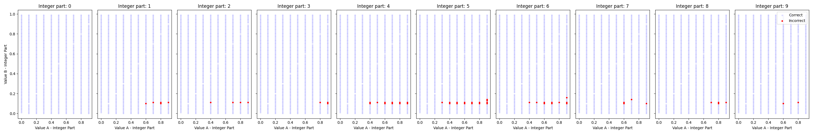

# Which is bigger, 9.9 or 9.11? LLM不会简单的比大小？

## 已完成
1. 提出并构建了一部分比大小数据集。

结论：小数部分0.11的错的最多
0.10错的第二多
其他位数基本不会错
纯小数也不会错

flaot 文件夹为主要的实验结果

## 未完成
2. 在多个模型上进行广泛实验。
3. 分析LLM在数值比较任务中的弱点。

## 摘要

尽管LLM在复杂任务中表现出色，但在比较简单数值大小时却出现问题。

9.9 和 9.11 谁更大？大部分LLM无法正确回答这个简单的问题。

我们研究了这个现象并排除了提示词的影响，分析原因。

我们发现LLM在数学推理方面存在缺陷，无法准确比较两个数的大小。

## 3. 数据集

### 3.1 数据集构建

设计了一个全面的比大小数据集，包含多种数值比较任务。

### 3.2 实验设置

明确了比较任务，确保数值被正确解释，并开发了明确的提示词。

使用准确率、精度、召回率和F1分数作为评估指标，并分析模型的置信度评分。

通过创建完善的数据集和实验框架，识别LLM在数值比较上的具体弱点。

## 4. 实验设置

### 4.1 模型

使用了开源模型如Llama和GLM3，以及闭源模型如GPT4-o、GLM4、文心一言3.5等。

### 4.2 任务设置

选择题形式，比较AB的概率大小。

### 4.3 指标

使用准确率、精度、召回率和F1分数等指标进行评估。

## 5. 实验

### 5.1 整数大小

LLM可以比较整数大小。

### 5.2 小数大小

LLM可以比较纯小数大小。

### 5.3 整数加小数大小

不同位数情况下，LLM无法比较大小。

LLM的推理能力在这个问题上表现不佳。

我们进行了不同温度设置、Few-shot、CoT等实验。

通过不同任务实验，研究LLM的能力和缺陷。

