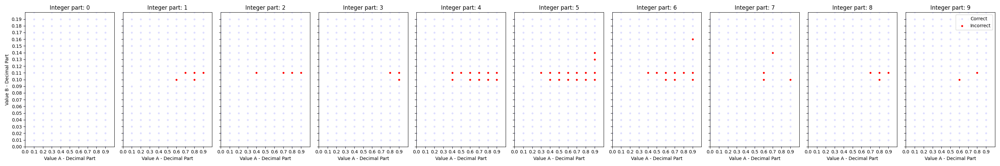
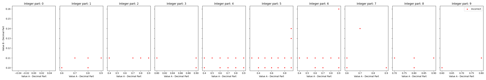
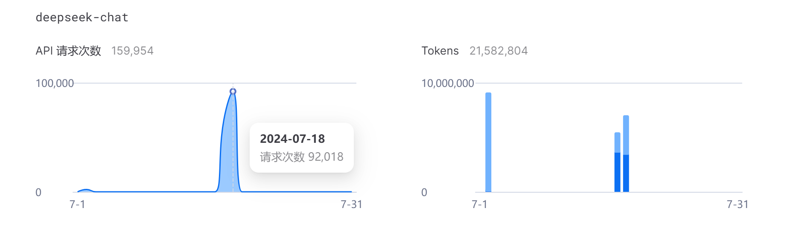

# Which is bigger, 9.9 or 9.11? LLM不会简单的比大小？

## 已完成
1. 提出并构建了一部分比大小数据集。

## 项目更新

- 构建对抗生成思路，寻找包含幻觉的问题，别人已经做了，但是是基于

- 对抗生成思路生成幻觉问题，给出50个问题，正确率是多少

### 2024.7.23
高频错误的数字统计

## 可视化结果

下面是9900个数据集上的结果，红点是错误的预测，蓝点是正确的

下面是在3600个数据集上的结果

    

    

# LLM 使用的 DeepSeekV2 调用情况
## 调用和 Token 使用情况
- 十几万次调用，千万 token.

## 数据集
生成了以下三种情况的数据：
1. 3600 条小数位长度不同但整数位相同的数据，例如 9.11 和 9.9（一位小数大于两位小数）。
2. 3600 条补零后小数位相同的数据，例如 9.11 和 9.90。
3. 9900 条不仅包含一位小数大于两位小数，还包含一位小数小于两位小数的数据，例如 9.99 和 9.9。

## Prompt
测试了以下 5 种不同的 prompt，包含中文和英文：
- prompt_0: `Which is larger? A: {} B: {} ## Please output only option A or option B.`
- prompt_1: `Which of these two numbers is larger? A: {} B: {} ## Please output only option A or option B.`
- prompt_2: `Which of these two numbers is larger? A: {} B: {} ## Please think step by step, and output your option A or B for the last letter.`
- prompt_3: `谁更大？ A: {} B: {} ##只输出选项A或者B`
- prompt_4: `这两个数字谁更大？ A: {} B: {} ##只输出选项A或者B`

每种 prompt 测试了六种温度情况：[1.25, 1, 0.75, 0.5, 0.25, 0]

## 结论
以下结论仅代表 DeepSeekV2：
1. LLM 可以理解纯小数比大小，例如 0.11 和 0.9，也可以理解整数比大小，例如 1 和 9。
2. 补零基本可以让 LLM 完全答对。
3. COT 基本也可以解决这个问题。
4. LLM 错误最多的情况是 X.11，其次是 X.10（X 代表 1 到 9 的整数）。
5. 温度越高，错误率基本不变，偶尔上升。

flaot 文件夹为主要的实验结果

## 计划完成
- 模型：添加更多模型实验
- 数字：更多位数的数字
- 同一类类型：比如X.11 X.10数字的更多位数
- 同一数字：多次数测试，比如X.11测试100次

## 摘要

尽管LLM在复杂任务中表现出色，但在比较简单数值大小时却出现问题。

9.9 和 9.11 谁更大？大部分LLM无法正确回答这个简单的问题。

我们研究了这个现象并排除了提示词的影响，分析原因。

我们发现LLM在数学推理方面存在缺陷，无法准确比较两个数的大小。

## 3. 数据集

### 3.1 数据集构建

设计了一个全面的比大小数据集，包含多种数值比较任务。

### 3.2 实验设置

明确了比较任务，确保数值被正确解释，并开发了明确的提示词。

使用准确率、精度、召回率和F1分数作为评估指标，并分析模型的置信度评分。

通过创建完善的数据集和实验框架，识别LLM在数值比较上的具体弱点。

## 4. 实验设置

### 4.1 模型

使用了开源模型如Llama和GLM3，以及闭源模型如GPT4-o、GLM4、文心一言3.5等。

### 4.2 任务设置

选择题形式，比较AB的概率大小。

### 4.3 指标

使用准确率、精度、召回率和F1分数等指标进行评估。

## 5. 实验

### 5.1 整数大小

LLM可以比较整数大小。

### 5.2 小数大小

LLM可以比较纯小数大小。

### 5.3 整数加小数大小

不同位数情况下，LLM无法比较大小。

LLM的推理能力在这个问题上表现不佳。

我们进行了不同温度设置、Few-shot、CoT等实验。

通过不同任务实验，研究LLM的能力和缺陷。

